# Part 1 - Setup

## Select AWS Region

Make sure you are running this lab on eu-west-1 region. 

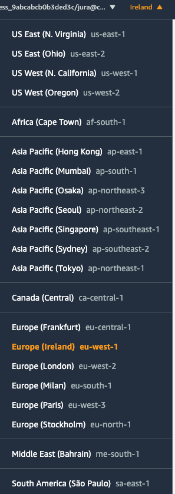

## Create Cloud9 envinronment

Open [Cloud9 console](https://eu-west-1.console.aws.amazon.com/cloud9) and create new Cloud9 environment.

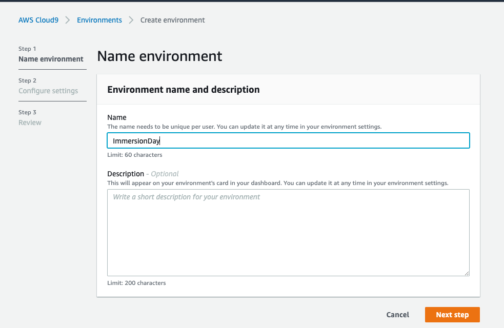

Leave the default setting as is and client "Next"

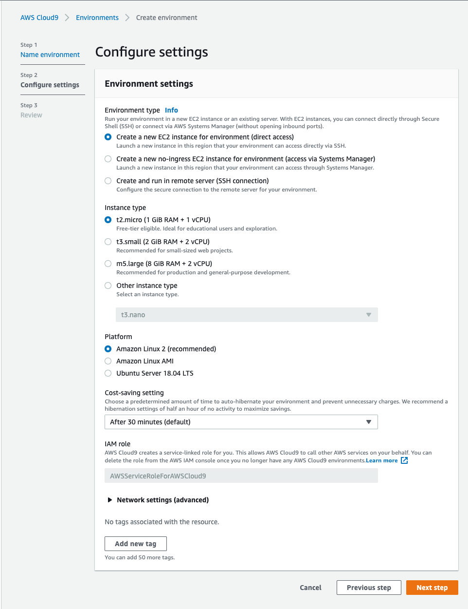

Click "Create envinroment"

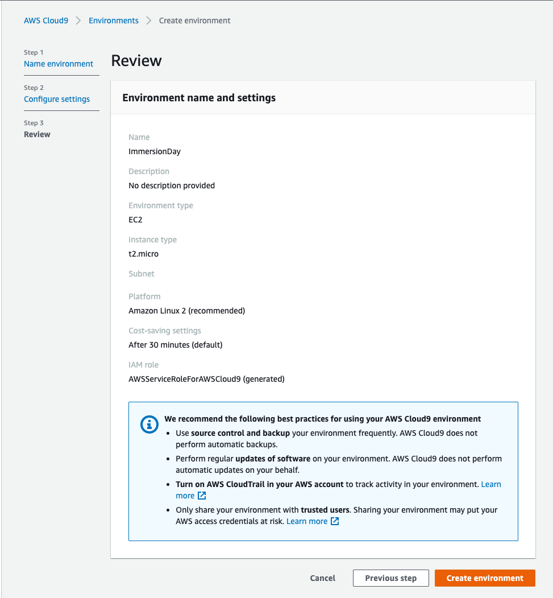

Once the Cloud9 instance is running, create ssh-key on Cloud9 terminal and upload it to github that will be used during the workshop. 

```
ssh-keygen -t rsa
```

Hit enter few times and once the key is generated, copy and paste the content of ~/.ssh/id_rsa.pub to [Github SSH keys](https://github.com/settings/keys). Remeber to delete the key after the workshop!

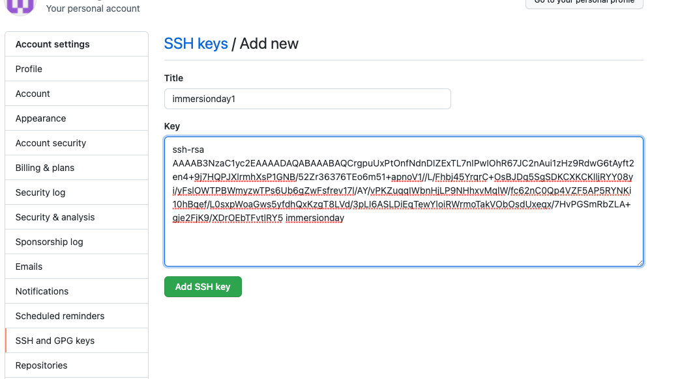

## Fork and clone the petclinic and workshop repositories

To begin the workshop fork the [petclinic](https://github.com/spring-projects/spring-petclinic) repository and clone it into your local environment (or, if you prefer, to your 
Cloud9 environment). Also clone this repository. 

`git clone https://github.com/<your-github-user>/spring-petclinic`

You will also need a personal token to be created in your Github account in order to allow pushes to the repository to
trigger the CodePipeline pipeline we are going to build.

Navigate to [New Personal Token](https://github.com/settings/tokens/new) page on GitHub, and generate a token with full 
control of your private repos.

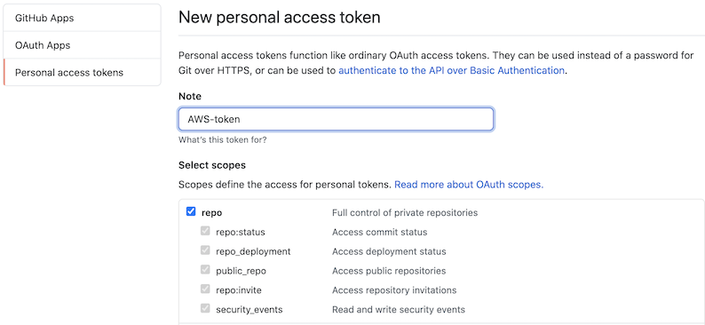


## Store the GitHub token as secret

Now we are going to use [AWS Secrets Manager](https://aws.amazon.com/secrets-manager/) to store this token securely, and
access it from our pipeline / Cloudformation stack.

Open [Secrets Manager console](https://console.aws.amazon.com/secretsmanager/) and add a new secret. Store the token
generated in the previous step as: 

```
Secret key: PersonalToken
```


Click "Next step"

```
Secret name: MyGitHubSecret
```

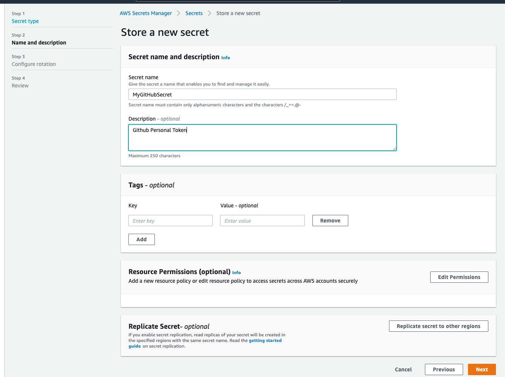

Disable automatic rotation and click "Next step": 

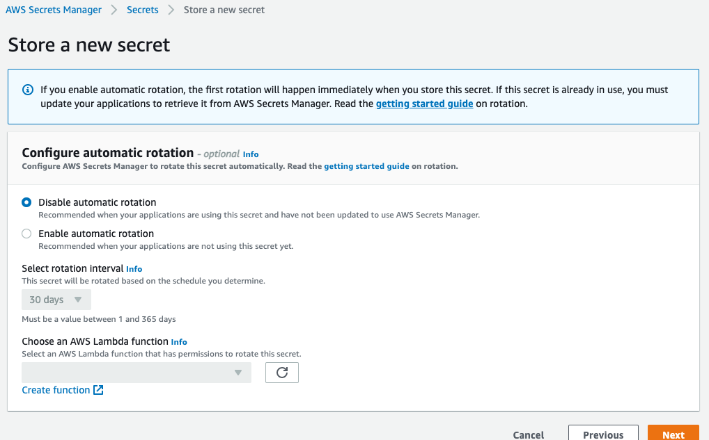

## Create the first Pipeline

Now, we are going to create a CodePipeline pipeline that triggers on new commits to your forked spring-clinic repository.

Run with the AWS CLI on a terminal:
```
aws cloudformation deploy --template-file ./cloudformation/1-codepipeline-github-webhook.yaml --stack-name cicd-workshop-pipeline --capabilities CAPABILITY_IAM --parameter-overrides BranchName=main GitHubOwner=<your-github-username>
```

Or deploy the template with the Cloudformation console. First go to the console and select `Create Stack` from the
drop-down choose `With new resources (standard)`

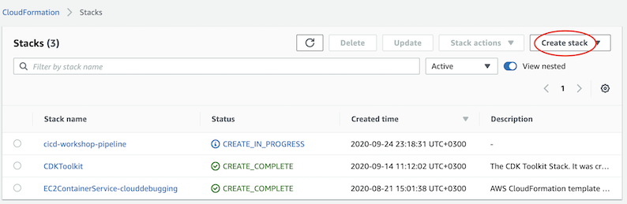

Then upload the file found from `1-Setup/cloudformation folder in this repo.

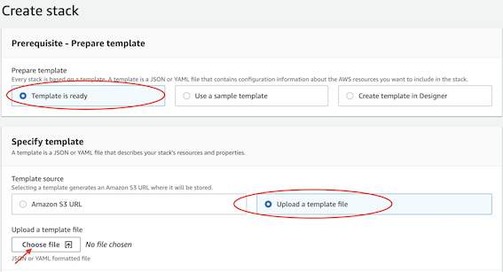`

Select `Next`, and provide a name for the stack as well as your GitHub username.

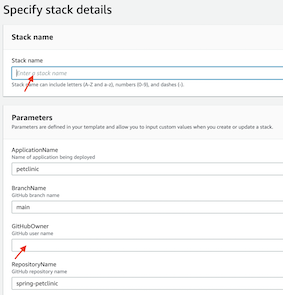

## Ready

After creating the stack, you should now have

- an S3 artifacts bucket
- a CodeBuild build project
- a CodePipeline pipeline
- IAM roles to be assumed by the CodeBuild project and the CodePipeline pipeline

The pipeline triggers on new commits to the 'main' branch of your repo. And so far it will consist of two actions
only, running in sequence: a *Source* action that gets the code from GitHub and zips it to the artifacts bucket, and
a *Build* action that invoke a build in the CodeBuild project above.
When creating the pipeline it will trigger once, get your code from GitHub, but the build will fail, since we haven't
yet provided a build specification to the CodeBuild project.

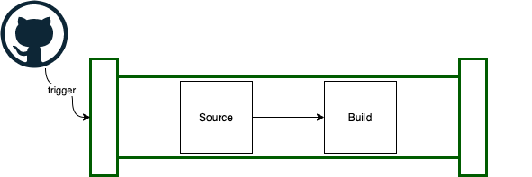

[Continue to section 2](../2-Build/README.md)

[Back to Main Section](../README.md)