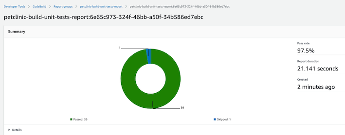
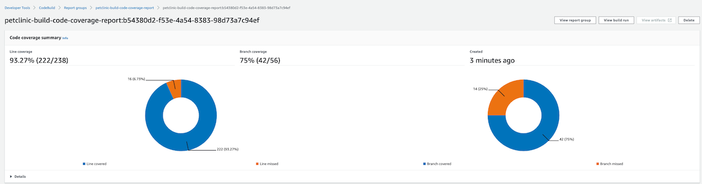

# Part 2 - Building and Containerizing the Petclinic Application

## First Build
Go back to your forked repository of spring-petclinic that is currently set to trigger the Pipeline we created in the
previous section. We will add a buildspec.yml file to the root of the repo - this will contain the steps that are required
to build the  petclinic Java application using Maven. This is what the file looks like:

**buildspec.yml**
```yaml
version: 0.2

phases:
  install:
    runtime-versions:
      java: corretto11
  build:
    commands:
      - echo Build started on `date`
      - ./mvnw install
      - JAR_VERSION=$(./mvnw help:evaluate -Dexpression=project.version -q -DforceStdout)
  post_build:
    commands:
      - echo Build completed on `date`
artifacts:
  files:
    - target/spring-petclinic-$JAR_VERSION.jar
```

This simple version of the buildspec.yml is just building the JAR File and pushing to S3 as an artifact. Push the new
file to your GitHub repo and access the [CodeBuild console](https://eu-west-1.console.aws.amazon.com/codesuite/codebuild/projects)
to see the progress of your build. After about 6min, you should have your first successful build of the Petclinic application
as a JAR file. You can check the results of the build either directly on the CodeBuild project console or from Cloudwatch
logs log group `/aws/codebuild/<name-of-build>`

## Containerizing our application
We have decided that we will host our Petclinic application as Docker containers running on the serverless container
service [AWS Fargate](https://aws.amazon.com/fargate/), which does not require the management of a cluster where to 
run the containers.

We will add a Dockerfile to our petclinic repository with instructions on how to build the container image, and we will
build it within the same CodeBuild build project. Add the following to your repository:

**Dockerfile**
```Dockerfile
FROM amazoncorretto
VOLUME /tmp
ARG JAR_FILE
ADD ./target/${JAR_FILE} app.jar
RUN sh -c 'touch /app.jar'
ENV JAVA_OPTS=""
ENTRYPOINT [ "sh", "-c", "java $JAVA_OPTS -Djava.security.egd=file:/dev/./urandom -jar /app.jar --spring.datasource.initialization-mode=always" ]
```

This is a simple Dockerfile that builds on top of the amazoncorreto Dockerhub image, which includes the Amazon Java runtime
, and adds the built JAR into it. Finally it sets the entrypoint as the Java run command with the built application as argument.

We need to now change our build specification to include the commands to build this docker image and publish it to a private
[ECR repository](https://aws.amazon.com/ecr/). First let's create the repository by simply navigating to the 
[ECR console](https://eu-west-1.console.aws.amazon.com/ecr/home?region=eu-west-1#) clicking on **Get Started** and provide
a repository name, e.g. petclinic.

Note the full path of your repository (URI), as we will need to tag the built image with that path. It will be of the form

`<account-id>.dkr.ecr.<region>.amazonaws.com/petclinic`

Now, we update the build specification `buildspec.yml` to authenticate to ECR, build the Docker image, tag it to the correct
repo in ECR and push it.

**buildspec.yml (2nd iteration)**
```yaml
version: 0.2

phases:
  install:
    runtime-versions:
      java: corretto11
  pre_build: ## New pre-build phase for authentication to ECR with Docker CLI
    commands:
      - echo Logging in to Amazon ECR...
      - $(aws ecr get-login --no-include-email --region $AWS_DEFAULT_REGION)
  build:
    commands:
      - echo Build started on `date`
      - ./mvnw install
      - JAR_VERSION=$(./mvnw help:evaluate -Dexpression=project.version -q -DforceStdout)
      ## Now building the Docker image with the docker CLI
      - echo Building the Docker image...
      - docker build --build-arg JAR_FILE=spring-petclinic-$JAR_VERSION.jar -t petclinic:$JAR_VERSION .
      ## And tagging it with correct URI
      - docker tag petclinic:$JAR_VERSION $AWS_ACCOUNT_ID.dkr.ecr.$AWS_DEFAULT_REGION.amazonaws.com/petclinic:$JAR_VERSION
  post_build:
    commands:
      - echo Build completed on `date`
      - echo Pushing the Docker image...
      - docker push $AWS_ACCOUNT_ID.dkr.ecr.$AWS_DEFAULT_REGION.amazonaws.com/petclinic:$JAR_VERSION
```

- Note that we have passed the `AWS_ACCOUNT_ID` as an environment variable to the CodeBuild project.
- The `AWS_DEFAULT_REGION` is part of the [default set of CodeBuild variables](https://docs.aws.amazon.com/codebuild/latest/userguide/build-env-ref-env-vars.html)
- Our CodeBuild Project IAM role, includes the correct permissions to read and write to ECR [link](../1-Setup/cloudformation/1-codepipeline-github-webhook.yaml)

Commit and push these changes, and watch your Container image being published to [ECR](https://eu-west-1.console.aws.amazon.com/ecr/repositories/petclinic/?region=eu-west-1)
and tagged with the version.

## CodeBuild Report Groups

You can create [reports in CodeBuild](https://aws.amazon.com/blogs/devops/test-reports-with-aws-codebuild/) that contain 
details about tests that are run during builds. CodeBuild supports various test report formats, such as Cucumber JSON or
JUnit XML.

Our sample **petclinic** application includes JUnit unit tests that are run during the *mvn install* command by 
the Maven surefire plugin. The result of these tests is stored in **target/surefire-reports**.

Another type of report supported by CodeBuild Report Groups is the [coverage report](https://docs.aws.amazon.com/codebuild/latest/userguide/code-coverage-report.html).
CodeBuild supports coverage reports in formats such as JaCoCo XML, SimpleCov JSON, Clover XML, or Cobertura XML.

Our sample **petclinic** application includes the [JaCoCo Maven plug-in](https://www.eclemma.org/jacoco/trunk/doc/maven.html)
for generation of test coverage reports. The generated report is placed in **target/site/jacoco/index.html** for unit
tests.

### Add Unit Test and Coverage Reports to CodeBuild Report Groups

Let's add this at the bottom of the *buildspec.yml* file above:

**buildspec.yml**
```yaml
(....)
reports:
  unit-tests-report: # For Unit Test Reports
    files:
      - '**/*'
    base-directory: 'target/surefire-reports'
    discard-paths: false
  code-coverage-report: # For Code Coverage Reports
    files:
      - jacoco.xml
    file-format: 'JaCoCoXml'
    base-directory: 'target/site/jacoco'
```

When you push the changes to your GitHub repo, and after the build completes, you can find the generated reports in the 
[CodeBuild Report Groups console](https://eu-west-1.console.aws.amazon.com/codesuite/codebuild/testReports/reportGroups).





You can proceed to [Part 3](../3-Artifact/README.md) of the workshop.

[Back to Main Section](../README.md)