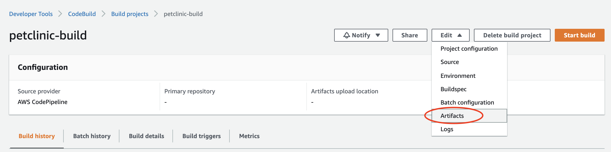
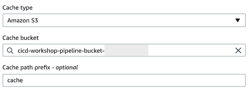
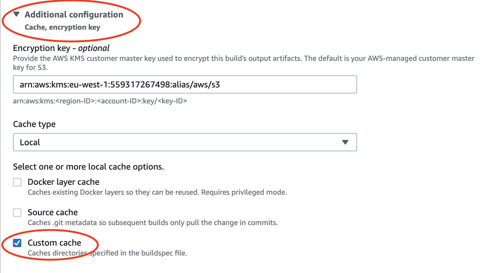
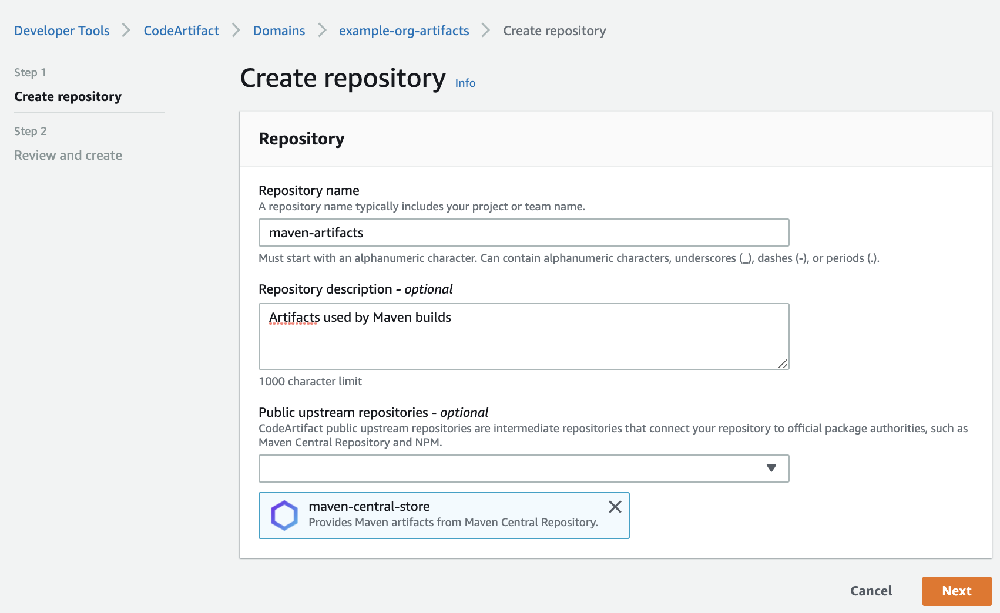
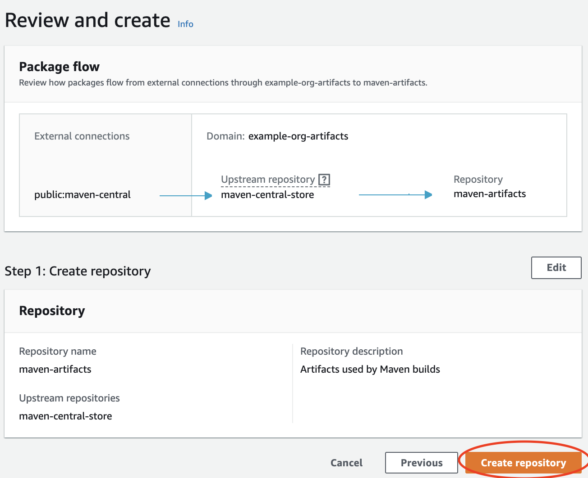

# Build Caching and Amazon CodeArtifact

We have noticed that most of the time spent during the build of our petclinic application is pulling Maven packages
from Maven central. It would be great to be able to use a local cache in order not to have to pull the same versions of 
the packages over and over again.

Also, it would be good to have a private store of all the used artifact in build across customer teams. [CodeArtifact](https://aws.amazon.com/codeartifact/)
provides just that - in case connectivity or the upstream repository fails, CodeArtifact stores a local copy closer to the
build environment. CodeArtifact currently supports Maven Central, npm public registry, and PyPi.

## Enabling S3 caching

S3 caching copies intermediary build artifacts to a bucket and location you specify. In this way, those artifacts can
be fetched from S3 the next time you build the same project.

Let's enable S3 caching and set our local build maven repository as the path to cache:

1 - Go to the [CodeBuild console](https://eu-west-1.console.aws.amazon.com/codesuite/codebuild/projects/)



2 - Expand *Additional configuration* at the bottom and select **Amazon S3** for *Cache type*. Add the same bucket
that is used by CodePipeline to store artifacts, and add a **cache** prefix.



3 - Click *Update artifacts* at the bottom

4 - We should instruct CodeBuild which paths to cache to S3, let's add the Maven repository path to the buildspec:

**buildspec.yml**
```yaml
(...)

cache:
  paths:
    - '/root/.m2/**/*'
```

After the first build with S3 cache type enabled, you should see a new key on the S3 bucket, with *cache* prefix. That
is a zipped file with the contents of the /root/.m2 folder, that will be downloaded to the CodeBuild container the next
time it runs. You should see a dramatic drop in your build times after this (down to ~1min).

## Alternative: Enabling local caching (Less reliable)

To enable local caching we have to update our Build Project.

We can do it via the [CodeBuild console](https://eu-west-1.console.aws.amazon.com/codesuite/codebuild/projects/)


followed by:



or by updating the CloudFormation stack with this for the CodeBuild project resource:

```yaml
  CodeBuildProject:
    Type: AWS::CodeBuild::Project
    Properties:
      Artifacts:
        Packaging: zip
        Type: codepipeline
      Description: Codebuild example project
      Name: !Sub ${ApplicationName}-build
      Environment:
        ComputeType: small
        EnvironmentVariables:
          - Name: S3_BUCKET
            Value: !Ref CodePipelineArtifactStoreBucket
          - Name: AWS_ACCOUNT_ID
            Value: !Ref "AWS::AccountId"
        Image: aws/codebuild/amazonlinux2-x86_64-standard:3.0
        PrivilegedMode: true
        Type: LINUX_CONTAINER
      ServiceRole: !Ref CodeBuildServiceRole
      Source:
        Type: codepipeline
      TimeoutInMinutes: 10
      Cache: # This specifies the Local Custom Cache option
        Type: LOCAL
        Modes:
          - LOCAL_CUSTOM_CACHE
```

There are three types of local caching, Docker layer caching, Source caching and Custom caching.
Here, and since our build slowness comes from a long list of packages to download from Maven Central we are configuring 
custom caching, and specifying the local directory maven uses to store packages.

Let's add to our build specification the path to cache. At the very end of the file:

**buildspec.yml**
```yaml
(...)

cache:
  paths:
    - '/root/.m2/**/*'
```

> &#x26a0;&#xfe0f; **Local caching is reliant on the same instance being reused** for subsequent builds of the same Project.
> In practice, CodeBuild agressively recycles the instances being used and unless your project is not under heavy utilization
> you might not see the effects of this change.

In the subsequent changes that will trigger builds, pay attention to whether the local
caching is being used. In case it is you will see the build go down from ~6 min to ~1 min. From the logs you can confirm
that packages are not downloaded again but are found from the building instance. From the logs you will see that CodeBuild
will attempt to symlink the cache to the build.

## Using CodeArtifact

We are going to use our own local artifact repository with our builds now, powered by AWS CodeArtifact. The advantage is
that we will be able to securely store, publish and share software packages within the Organisation as a managed service.

We will create a CodeArtifact Domain - this can be used in a multi-account setup to apply policies and manage access across
the organisation. CodeArtifact does not *yet* provide support for CloudFormation, so we will use an API call (or the console)
to create our domain:

`aws codeartifact create-domain --domain example-org-artifacts --region eu-west-1`

1 - Now, if we [navigate to our domain](https://eu-west-1.console.aws.amazon.com/codesuite/codeartifact/d/559317267498/example-org-artifacts),
we will see that there are no repositories yet within it.

2 - Push **Create Repository** and fill with the following information:



Note that we added a public upstream repository for fetching packages needed by the build the first time.

3 - Push **Next** and review the workflow:



4 - Click on **Create repository**

5 - Now, on the repository itself, click on **View connection instructions** to see how to configure our builds to use the
newly configured repository. Choose **mvn** as the package manager client.

6 - Create a **settings.xml** in the petclinic repository with all the sections displayed in the instructions, wrapped
in \<settings\>\</settings\>

**settings.xml**
```xml
<settings>
    <profiles>
      <profile>
        <id>example-org-artifacts--maven-artifacts</id>
        <activation>
          <activeByDefault>true</activeByDefault>
        </activation>
        <repositories>
          <repository>
            <id>example-org-artifacts--maven-artifacts</id>
            <url>https://example-org-artifacts-${env.AWS_ACCOUNT_ID}.d.codeartifact.eu-west-1.amazonaws.com/maven/maven-artifacts/</url>
          </repository>
        </repositories>
      </profile>
    </profiles>
    <servers>
      <server>
        <id>example-org-artifacts--maven-artifacts</id>
        <username>aws</username>
        <password>${env.CODEARTIFACT_AUTH_TOKEN}</password>
      </server>
    </servers>
    <mirrors>
      <mirror>
        <id>example-org-artifacts--maven-artifacts</id>
        <name>example-org-artifacts--maven-artifacts</name>
        <url>https://example-org-artifacts-${env.AWS_ACCOUNT_ID}.d.codeartifact.eu-west-1.amazonaws.com/maven/maven-artifacts/</url>
        <mirrorOf>*</mirrorOf>
      </mirror>
    </mirrors>
</settings>
```
We need to tell CodeBuild to apply these settings to the Maven build, so we will copy this file to the Maven configuration
default directory, before starting the build. We also need to generate an authentication token (valid for 12h) for CodeArtifact
within the build, and export it as an environment variable, that will be used by the Maven settings (**CODEARTIFACT_AUTH_TOKEN**).

Copy the token generation `export` command from the top of the **Connection instructions** details. Note that below we
replaced the AWS account ID with the environment variable that is passed to CodeBuild via the Project's environment variables.

Also, note that we are able to generate an auth token to CodeArtifact within our build project since it was assigned 
an IAM role that has the right permissions to CodeArtifact.

**buildspec.yml**
```yaml
version: 0.2

phases:
  install:
    runtime-versions:
      java: corretto11
    commands:
      - echo Copying settings.xml file for Codeartifact
      - cp ./settings.xml /root/.m2/settings.xml
  pre_build:
    commands:
      - echo Logging in to Amazon ECR...
      - $(aws ecr get-login --no-include-email --region $AWS_DEFAULT_REGION)
      - echo Get Codeartifact Auth token...
      - export CODEARTIFACT_AUTH_TOKEN=`aws codeartifact get-authorization-token --domain example-org-artifacts --domain-owner $AWS_ACCOUNT_ID --query authorizationToken --output text`
(...)
```

With these changes in place, we are ready to commit and push - and watch what happens to our CodeArtifact repository.

When the build is ongoing, you can browse the packages and versions that were retrieved from Maven Central in the 
repository we created.

Now we will modify our project's POM.xml file to push our built application to our CodeArtifact repository as well. In this
way, teams are able to share their own Java packages through the CodeArtifact private repository. Add:

**POM.xml**
```xml
<project>
(...)
  <distributionManagement>
    <repository>
      <id>example-org-artifacts--maven-artifacts</id>
      <name>example-org-artifacts--maven-artifacts</name>
      <url>https://example-org-artifacts-${env.AWS_ACCOUNT_ID}.d.codeartifact.eu-west-1.amazonaws.com/maven/maven-artifacts/</url>
    </repository>
  </distributionManagement>
(...)
</project>
```

You will also need to add the Maven **deploy** command to your buildspec. The Maven deploy instruction will put your 
packaged maven project into our remote repository for sharing with other developers:

**buildspec.yml (2nd iteration)**
```yaml
version: 0.2

phases:
(...)
  build:
    commands:
      - echo Build started on `date`
      - ./mvnw install
      - ./mvnw deploy
      - JAR_VERSION=$(./mvnw help:evaluate -Dexpression=project.version -q -DforceStdout)
(...)
```

After adding the changes above and waiting for the build to finish, you should now see our petclinic application published
to CodeArtifact as

`org.springframework.samples:spring-petclinic`

[Continue to section 4](../4-Deploy/README.md)

[Back to Main Section](../README.md)