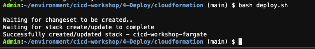

# Deploying our Containerized Petclinic Application to Fargate with B/G

Now we have an image on ECR ready to be deployed into an ECS cluster, an EKS cluster or Fargate, which is AWS's serverless
container management offering. In this lab we will focus on Fargate, since it will prevent us from having to create
a cluster of virtual EC2 instances for running our containers on.

We will use the CodeDeploy service for deploying our application revisions in a controlled manner, using a Blue/Green
strategy.

## Provision Infrastructure for Fargate Service

 During the initialisation of your AWS accounts we created a new VPC with a Fargate Cluster, a Network Load Balancer, 
 two 'listeners' and two 'target groups', together with a Fargate Service that is running nothing (desired tasks set to 0).
 These resources were created with Cloudformation based on the template that you can find in this repo:
 
 `4-Deploy/cloudformation/VPCFargateALB.yaml`
 
 If running this workshop on your own AWS account, create a stack with the above template. If you are using Cloud9 IDE, go to workshop repository directory and run

 ```
  bash deploy.sh 
 ```

 It will take few moments to create needed resources. 


 
## Create IAM role for CodeDeploy
 
We need to create a new IAM role that the CodeDeploy service can assume, to do the needed operations in ECS, the LB and 
Target Groups for deploying the application. The IAM role creation wizard helps you do that easily:

1 - Open the [role creation wizard](https://console.aws.amazon.com/iam/home#/roles$new?step=type)

2 - Select 'CodeDeploy' as the trusted service for the new role


Select the CodeDeploy - ECS 'use case' at the bottom. That will attach the needed Managed IAM policy to the role.


 
Click 'Next' until you get to the 'Create role' screen where you need to input a name for the role, for e.g.:

**ECSCodeDeployRole**
 
## Create CodeDeploy Application and Deployment Group
  
  In order to deploy our petclinic container to Fargate using CodeDeploy, we need to create an application with at least 
  one Deployment Group which targets the Fargate cluster and service. Furthermore, we need to specify two listeners and two
  target groups on the Fargate service Load Balancer, that CodeDeploy will use to manage traffic routing during the Blue/Green
  deployment.
  
  1 - Create a new application in the [CodeDeploy console](https://eu-west-1.console.aws.amazon.com/codesuite/codedeploy/application/new?#)
  called for e.g. *petclinic* and select 'Amazon ECS' for the compute platform.
  
  
  
  2 - Now inside the CodeDeploy application click to *'Create deployment group'* most of the parameters can be filled from
  pre-populated items in the drop-downs. Choose a name for the deployment group, e.g. *petclinic-fargate*, pick the service
  role created in the previous step, and select the Fargate Cluster and Service that were created in your account.
  
  
  
  3 - Now we configure the load balancing of our Blue and Green traffic (or Prod and Test). Note that we have two listeners
  one on port 80 and the other on port 8080. We will use port 8080 to test new versions of our application, and port 80
  as custom will serve production traffic. In our Security Group configuration, we let the 'world' access both listeners,
  but in a real scenario you would restrict the test listener port to only allow for e.g. internal teams to access.
  
  The two Target Groups will interchangeably include either of the Blue or Green Fargate tasks, or after cut-over
  the previous iteration 'Blue' (old version) target group will be 'empty', and will be filled with the new 'Green'
  application version at the next deployment.
  
  
  
  4 - We can also set various parameters on the orchestration of the deployment itself. We will pick the option to 'Specify
  when to reroute traffic', and add a 30min wait there. We will then have time to check our Green version and an option
  to manually trigger the rerouting of traffic in the CodeDeploy deployment console. In this case we are selecting an
  'all at once' traffic rerouting policy, meaning that all production traffic will go to the new version once we trigger
  the rerouting, but we could have progressive approaches (also called Canary) that allow us to catch errors early and
  possibly rollback the deployment.
  
  
    
  5 - Finally, Click *Create deployment group* at the bottom.
 
 ## Update Pipeline with the 'Deploy' Action
 
 Let's add the Deploy stage to our pipeline:
 
 
 
 1 - Navigate to your [Codepipeline pipeline](https://eu-west-1.console.aws.amazon.com/codesuite/codepipeline/pipelines/petclinic-pipeline/view?region=eu-west-1)
 and click on 'Edit'
  
 
 
 2 - Add a new Stage
 
 
 
 3 - Give it a name (e.g. 'Deploy') and push *Add stage*
 
 4 - Now inside the new stage, add an action group.
 
 
 
 5 - Select a name for the action, e.g. "DeployToFargate".Select *Amazon ECS (Blue/Green) as the *Action provider*.
 
 6 - Now fill in the rest of the details.
 
 - For **Input artifacts** select 'SourceOutput'. This will get some required definition files for the deployment from our repo.
 - In **Input artifacts** add a second artifact with the 'BuildOutput'
 - For **CodeDeploy Application Name** and **Deployment Group** select the previously created ones.
 - For **Tasks Definition** and **AppSpec** file, choose *SourceOutput* for **Select input artifact** and leave the default path.
 - In **Dynamically update task definition image** we are going to use the container URI generated in the build step and
 replace it on the task definition file dynamically. In **Input artifact with image details** add *BuildOutput* and for
 the **Placeholder text in the task definition** use *IMAGE1_NAME*. In the next section we'll create or generate these 
 files (task definition, appspec, and image details) required for our ECS B/G deployment.
  
 
 
 7 - Click *Done*, and *Save* the pipeline changes

## Generate a imagedetail.json, and add taskdef.json and appspec.yaml files to the Source code

According to the Codepipeline [userguide](https://docs.aws.amazon.com/codepipeline/latest/userguide/file-reference.html)
an *imageDetail.json* is required for the ECS Blue/Green deployment action. Using *ECR* as the source, this file gets
generated and passed on to the next stage automatically - here, we generate it dynamically in our build and export it as
an Output artifact to the *Deploy* stage by modifying the **buildspec.yml** file as such:

**buildspec.yaml**
```yaml
(...)
  post_build:
    commands:
      - echo Build completed on `date`
      - echo Pushing the Docker image...
      - docker push $AWS_ACCOUNT_ID.dkr.ecr.$AWS_DEFAULT_REGION.amazonaws.com/petclinic:$JAR_VERSION
      - printf '{"ImageURI":"%s.dkr.ecr.%s.amazonaws.com/petclinic:%s"}' "$AWS_ACCOUNT_ID" "$AWS_DEFAULT_REGION" "$JAR_VERSION" > imageDetail.json
(...)
artifacts:
  files:
    - imageDetail.json
```

> &#x26a0;&#xfe0f; Note that ECS B/G Deployment action expects as its input artifact a sole file *imageDetail.json* so
> we need to exclude other files such as the built jar from the artifact bundle. If we would like to provide both as
> artifacts, we would need to create a named secondary-artifacts on the buildspec for imageDetail.json. In this case
> we are not exporting the JAR as an artifact to S3 since we are already storing it in CodeArtifact.  

Add the following files to your repository. Make sure to replace the executionRoleArn with your specific ECS Task execution
role. This is that role that allows the ECS service to pull your container from ECR. Also in *containerDefinitions* make
sure the *name* of the container is the same as in the **PetClinicServiceTaskDef** resource in the template 
`./cloudformation/VPCFargateALB.yaml` (*web*)

**taskdef.json**
```json
{
  "executionRoleArn": "REPLACE WITH YOUR OWN EXECUTION ROLE ARN (SEE ECSTaskExecutionRole OUTPUT OF CLOUDFORMATION)",
  "containerDefinitions": [
    {
      "name": "web",
      "image": "<IMAGE1_NAME>",
      "essential": true,
      "portMappings": [
        {
          "protocol": "tcp",
          "containerPort": 8080
        }
      ]
    }
  ],
  "requiresCompatibilities": [
    "FARGATE"
  ],
  "networkMode": "awsvpc",
  "cpu": "512",
  "memory": "1024",
  "family": "PetClinicTaskDefinition"
}
```
**appspec.yaml**
```yaml
version: 0.0
Resources:
  - TargetService:
      Type: AWS::ECS::Service
      Properties:
        TaskDefinition: <TASK_DEFINITION>
        LoadBalancerInfo:
          ContainerName: "web"
          ContainerPort: 8080
```

Commit these files to your GitHub repo, and the buildspec change, and watch as your pipeline progresses. When it gets
to the 'Deploy' stage, click on 'Details' to be taken to the Deployment progress page on the CodeDeploy console.


## Switching to our new application version

In the deployment console, you will see various steps and a progress indicator. Once we have completed Steps 1 and 2, we
now have two environments - a Blue environment with the 'old' version still in production - and a Green environment with
the new candidate. We can use the 8080 listener that we configured for our load balancer, to view the Green version, and
possibly run some smoke tests before switching traffic.


Note that we have added a wait time of 30 minutes. We could have automatically start traffic shifting as soon as the new
version was able to start and respond to the health-checks - but in this case we want that extra level of control and
manual checking.

Again get your Load Balancer URL from the Fargate Cloudformation stack output, and open it on port 8080 in your browser.

`http://LB_URL:8080`

If this is your first deployment, you will see the deployed Petclinic application on the Green (8080) port and the 
previous placeholder tomcat docker container on the Blue (80) port.

We are now ready to switch traffic to our new application - on the Deployment details page, click on *Reroute traffic*
to switch the new version to 'production'.


We selected a 'shift all at once' approach, where all traffic will be sent to the new application. However, if we want
to check for possible errors against real production traffic, we could introduce the change gradually, in terms of how
much traffic to reroute in how long time increments. Some users would see the new version while others would still see
the old version.

Soon after you click on reroute traffic, you should be able to access the new petclinic application on the production
port (80). Your browser might be caching the old page for some time, in order to be sure, issue a `curl` command to 
confirm that you are getting the correct version.


The deployment will only finish after the original environment is terminated. We have added a wait of 1h before doing so,
this allows our previous environment to be available for quick rollback during this time. In order to finish the deployment
we need to click on *terminate original task set*.

> Play with it, add changes to the Petclinic application, and watch as they go through the pipeline, to the built container
> and get deployed in B/G fashion. Do some changes to the background color of the petclinic application, add some text, 
> experiment until you are comfortable with the deployment process.
 
 [Back to Main Section](../README.md)